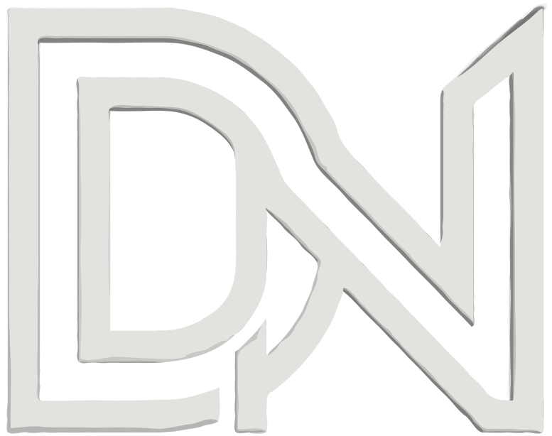

<p align="center">
  <picture>
    <source media="(prefers-color-scheme: dark)" srcset="./public/logo_white.svg" />
    <source media="(prefers-color-scheme: light)" srcset="./public/logo.svg" />
    
  </picture>
</p>

<h1 align="center">DEV NOIR STUDIO</h1>

<p align="center">
  <b>Minimalist Digital Architecture • Motion Visuals • Black & White Aesthetics</b>
</p>

<p align="center">
  <a href="#services"></a>
  <a href="#tech-stack"></a>
  <a href="#tech-stack"></a>
  <a href="#tech-stack"></a>
  <a href="#tech-stack"></a>
</p>

---

## Overview

**DEV NOIR** is a premier freelance web service studio specializing in high-end digital architecture, fluid motion visuals, and bespoke web engineering. We bridge the gap between creative artistry and technical execution to deliver web applications that captivate users and drive performance.

Whether you need a bespoke full-stack platform, an immersive brand showcase, or complex client interaction systems, DEV NOIR crafts digital experiences with extreme attention to aesthetic perfection, interactive fidelity, and network performance.

---

## Core Freelance Services

| Service | Description |
| :--- | :--- |
| **Web Architecture** | Scalable, modern web application foundations built on Next.js App Router and full-stack API architectures. |
| **UI/UX & Motion Design** | Ultra-luxury design systems, interactive kinetic typography, micro-animations, and glassmorphism styling. |
| **Full-Stack Engineering** | End-to-end development combining reactive frontends with robust Node.js/Express backends and databases. |
| **AI Integration** | Intelligent workflow automation, AI-driven asset generation, and smart user interface capabilities. |
| **Performance Optimization** | Network-adaptive media delivery (3G/4G/5G auto-tuning), sub-second page loads, and smooth 60fps renders. |
| **Security & Code Audit** | Comprehensive codebase audits, vulnerability fixes, type safety, and clean software practices. |

---

## Featured Client Projects

| Project | Category | Tech Stack | Live Demo |
| :--- | :--- | :--- | :--- |
| **WHITELY** | Full-Stack Platform | Next.js, Node.js, Express, MongoDB, Tailwind CSS | [Live Preview](https://whitely.vercel.app/) |
| **CREMA BAR** | Creative Portfolio | HTML5, CSS3, JavaScript, GSAP Animations | [Live Preview](https://crema-bar.vercel.app/) |
| **VELMORA** | Luxury Showcase | Next.js, TypeScript, Framer Motion, Tailwind CSS | [Live Preview](https://velmora-kappa.vercel.app/) |

---

## Key Architectural Features

- **Network-Adaptive Delivery**: Automatically adjusts video background resolution, WebP image sizing, and animation intensity based on user connection speed (2G/3G/4G/5G).
- **Audio-Tactile Feedback System**: Features real-time C-Major diatonic piano sound synthesis (`Howler.js`) coupled with device vibration haptics on interactive elements.
- **Font Morphing Bar Containers**: Interactive hover transitions smoothly morphing between geometric futuristic sans (`Orbitron`) and luxury architectural extended typefaces (`Syncopate`).
- **GSAP ScrollTrigger Pinned Conveyor**: Horizontal right-to-left card conveyor stacking mechanism for interactive project exploration.
- **Lenis Inertial Smooth Scroll**: Seamless scroll-driven motion across all viewports.
- **Glassmorphism Floating Dock**: Minimalist dock navbar with real-time viewport idle auto-dimming.

---

## Technology Stack

- **Framework**: [Next.js 16 (App Router)](https://nextjs.org/)
- **Library**: [React 19](https://react.dev/)
- **Language**: [TypeScript](https://www.typescriptlang.org/)
- **Styling**: [Tailwind CSS v4](https://tailwindcss.com/)
- **Animations**: [GSAP](https://greensock.com/gsap/) + [ScrollTrigger](https://greensock.com/scrolltrigger/) & [Framer Motion](https://www.framer.com/motion/)
- **Audio & Haptics**: [Howler.js](https://howlerjs.com/)
- **Smooth Scroll**: [Lenis](https://lenis.darkroom.engineering/)
- **Icons**: [Lucide React](https://lucide.dev/)
- **Image Optimization**: [Sharp](https://sharp.pixelplumbing.com/)

---

## Getting Started

### Prerequisites

Ensure you have Node.js (v18+) and npm installed on your system.

### 1. Installation

Clone the repository and install dependencies:

```bash
git clone https://github.com/Aswin-cs/dev_noir.git
cd dev_noir
npm install
```

### 2. Development Server

Run the local development server:

```bash
npm run dev
```

Open [http://localhost:3000](http://localhost:3000) with your browser to view the application.

### 3. Production Build

To build the production bundle:

```bash
npm run build
npm start
```

---

## Project Structure

```
dev_noir/
├── app/                        # Next.js App Router (Layouts & Pages)
│   ├── layout.tsx              # Root Layout with Font & Metadata Configuration
│   ├── page.tsx                # Main Landing Page Architecture
│   └── globals.css             # Design Tokens & Global Tailwind v4 Styles
├── components/                 # UI & Motion Components
│   ├── HeroSection.tsx         # Kinetic Typography & Video Background
│   ├── ServicesSection.tsx     # Font Morphing & Audio-Haptic Service Bars
│   ├── ProjectsSection.tsx     # GSAP Pinned Card Stacking Showcase
│   ├── Navbar.tsx              # Header Brand Navigation
│   ├── BottomNavbar.tsx        # Floating Glass Dock Navbar
│   ├── NetworkQualityProvider.tsx # Adaptive Network State Manager
│   └── LoadingScreen.tsx       # Preloader Screen
├── public/                     # Static Assets & Media
│   ├── logo.svg                # Brand Dark Logo
│   ├── logo_white.svg          # Brand Light Logo
│   ├── assets_responsive/      # Optimized WebP Image Assets
│   └── sounds/                 # Audio Synthesis Assets
└── package.json                # Project Dependencies & Scripts
```

---

## Get in Touch

Ready to elevate your digital presence with **DEV NOIR**?

- **Website**: [Dev Noir Studio](http://localhost:3000)
- **Services**: Web Architecture, Motion Design, Full-Stack Engineering
- **Repository**: [Aswin-cs/dev_noir](https://github.com/Aswin-cs/dev_noir)

---

<p align="center">
  Designed & Built with precision by <b>DEV NOIR STUDIO</b> © 2026. All rights reserved.
</p>
